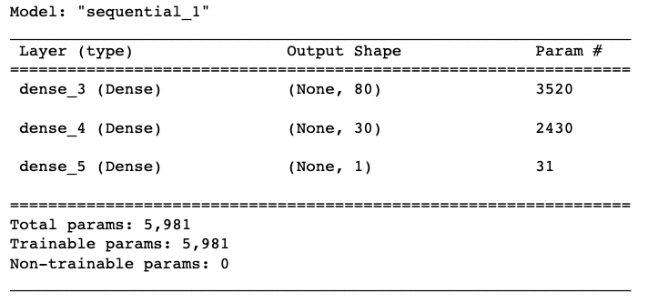

# Neural Network Charity Analysis
Predicting start up success using Machine Learning Neural Networks

Using Python, Pandas, Scikit-Learn, TensorFlow, and Keras to preprocess a dataset, transform the data, train Machine Learning models on the data, and evaluate the predictive power of those models. 

## Overview
The purpose of this project was to provide predictive insight for an organization looking to screen startups applying for funding assistance. To do so, this project sought to create a binary classifier capable of predicting the overall success of start ups at a rate of 75% based on select features drawn from a dataset. The funding applicant data came in a CSV containing more than 34,000 organizations that had received funding over the years. This dataset included a number of columns capturing metadata about each organization, such as: organization name, application type, government classification, use case, status, funding amount, whether or not funds were used successfully, etc. 

## Resources
  * Python
  * Pandas
  * Scikit Learn
  * TensorFlow
  * Keras

# Results
The following processes were performed to transform, analyze, train and test machine learning models with the data. As mentioned, a data file of characteristics for over 34,000 start ups was used to conduct the analysis. The data was first reduced by dropping unnecessary columns. Then the data was further reduced by binning column data with low category counts into one category. Next, the categorical data was encoded and the feature set and target (‘Is_Successful’) were identified. In final preparation for model fitting, the data was split into training and testing sets and then scaled.

Figure 1. Dropping Unnecessary Columns

Figure 2. Binning Features with low Value Counts

Figure 3. PCA Reduction to Three Features

### Neural Network Model 1
The first Neural Network Deep Learning Model was developed to fit, train, and test on the data. The model used two hidden layers using ReLU activation functions, the first of which had 80 nodes while the second had 30 nodes.  The output layer used a Sigmoid activation function. Additionally, the model’s weights were saved every 5 epochs to an HDF5 file. As seen in Figure 5, the Loss ( 0.566) was a bit high and the accuracy (0.726) a little lower than our desired accuracy of 75%. 

Figure 4. Neural Network Model 1

Figure 5. Loss and Accuracy for Neural Network Model 1

### Neural Network Model 2
In an attempt to improve the model performance, changes to the features were investigated to improve model performance. A correlation matrix was created to identify features with very weak relationships with the target variable. After doing so, six features were identified with correlation less than +/- 0.005 with the target variable.  These features were dropped and the model was retrained and tested. The performance was only slightly improved (loss = 0.560, accuracy = 0.733).

Figure 6. Neural Network Model 2 Loss and Accuracy

### Neural Network Model 3 
Next, another attempt was made to improve the model by adjusting the number of layers and neurons. The first hidden layer was increased to 100 neurons based on the convention of using 2-3 times the number of features. In this case our features were reduced to 35 so this was at the upper end of conventional recommendations. For the second hidden layer, the neurons were increased from 30 to 50 in an attempt to further distribute computation.  An additional layer was added as well with 25 neurons to increase the model’s capacity for complexity. Again, the model was only slightly improved (loss = 0.567, accuracy = 0.734). 

Figure 7. Neural Network Model 3

 Figure 8. Neural Network Model 3 Loss and Accuracy
 

### Neural Network Model 4
A final attempt was made to optimize the model by changing activation functions. All layers were switched to Sigmoid activation functions. Little change was observed for both loss (0.545) and accuracy (0.731). 

Figure 9. Neural Network Model 4

 Figure 10. Neural Network Model 4 Loss and Accuracy
 

# Summary
The following observations were discovered through this analysis. Unfortunately, a neural network model was not able to be designed to predict at the target accuracy of 75% or greater. However, slight improvements were made by dropping columns, adding layers and adjusting neuron configurations. Additionally, a Random Forest model and Logarithmic regression model were explored in parallel. The Random forest model performed similarly to the deep learning model in every test with an average accuracy of about 0.72.  The logarithmic regression model performed much more poorly (avg ~0.48). In light of these observations, further investigation could be done on the data itself. Features should be analyzed for outliers, skewness, or other anomalies that might be impacting model performance.  
